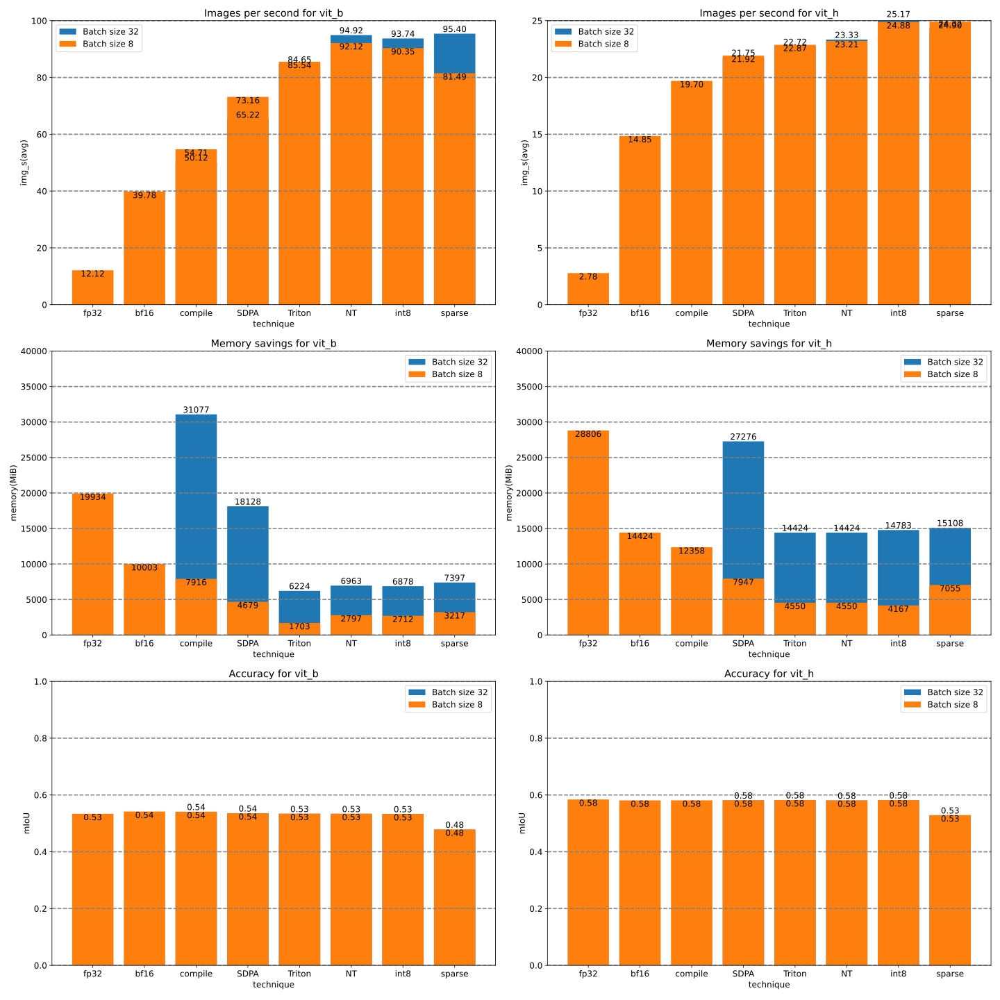

# Segment anything ... Fast

This work is based on a fork of https://github.com/facebookresearch/segment-anything

The corresponding blog post is https://pytorch.org/blog/accelerating-generative-ai/


## Installation


Step 1

Get latest PyTorch nightly


For example:
```
pip3 install --pre torch torchvision torchaudio --index-url https://download.pytorch.org/whl/nightly/cu121
```

Installation instructions vary by platform. Please see the website https://pytorch.org/


Step 2

Install the package

```
pip install git+https://github.com/pytorch-labs/segment-anything-fast.git
```

## Usage

The package acts like a drop-in replacement for segment-anything.

So, for example, if you're currently doing `from segment_anything import sam_model_registry` you should be able to do `from segment_anything_fast import sam_model_registry`.

However, you're likely here because you want to try a fast, inference version. So we also created a `sam_model_fast_registry` that automatically applies
- Sets `eval` mode
- Uses `bfloat16`
- Enables torch.compile with max-autotune
- Uses a custom Triton kernel that implements SDPA for relative positional encodings for long sequence lengths

The custom Triton kernel in particular was written for A100. If you're not using an A100, we will try to rerun autotuning on your device and locally save the best configs.
You might still run into performance issues, so you can disable the kernel by setting the environment variable `SEGMENT_ANYTHING_FAST_USE_FLASH_4=0`

Please also note that the first time you're running this model you'll likely need to wait a bit for it to compile.

If you'd like to see the details on how to reproduce all results, please see the README in the experiments folder above.

Please don't be shy to open a Github issue if you're missing functionality or find an issue. Thank you.

## Results

The results show a waterfall of techniques.

Left to right these techniques are combined.

That means the very last bar is the combination of
- bfloat16
- torch.compile with max-autotune
- [torch.scaled_dot_product_attention](https://pytorch.org/docs/main/generated/torch.nn.functional.scaled_dot_product_attention.html)
- A custom Triton kernel that implements SDPA for relative positional encodings for long sequence lengths
- NestedTensors
- Dynamic int8 symmetric quantization
- 2:4 sparse format



## License

`segment-anything-fast` is released under the [Apache 2.0](https://github.com/pytorch-labs/segment-anything-fast/main/LICENSE) license.
